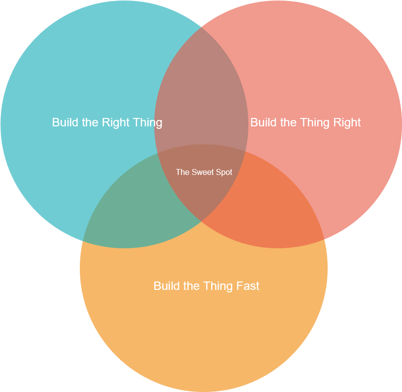

# Notes

## Ensuring Quality
Finding the right balance

## Henrik Kniberg
> Agile Product Ownership in a Nutshell  
> [YouTube Video](https://www.youtube.com/watch?v=502ILHjX9EE)

## INVEST

| Term | Description |
| ---- | ----------- |
| **I**ndependant | Wherever possible, stories should be implemented in any order |
| **N**egotiable | A story should invite further discussion. What not How. |
| **V**aluable | Describe something that can be used |
| **E**stimable | No further research needed, can be easily understood. |
| **S**mall | Can be released within weeks if not days. |
| **T**estable | Definition of Done is clear and can be evidenced. |

## How do we build the Right Thing?

As developers, how do we build the right thing?

* Is it usable?
* Is it testable?
* Is it resiliant?
* Is it scalable?
* Is it secure?
* Does it embrace change?